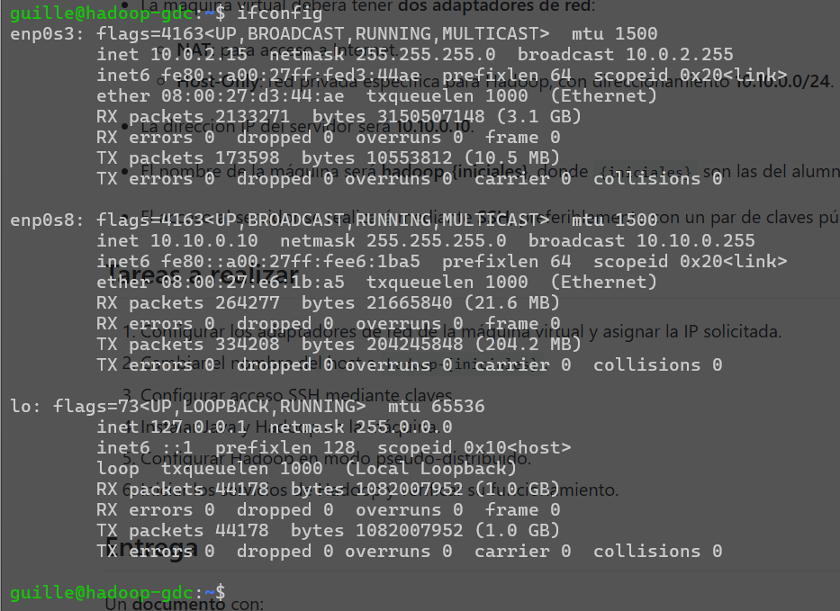
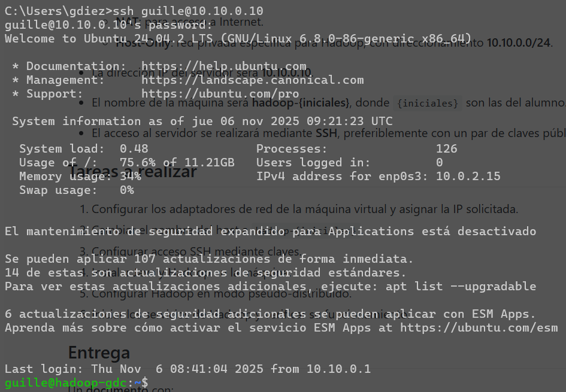
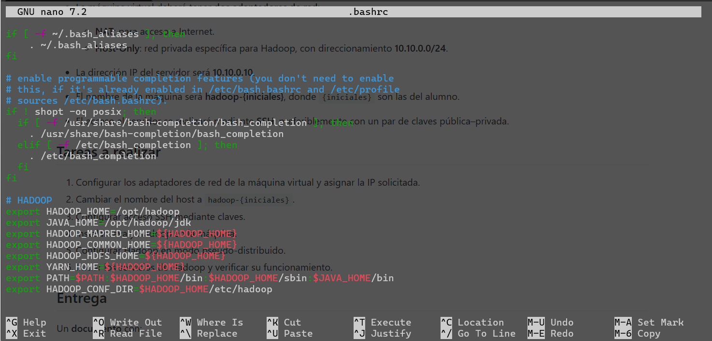
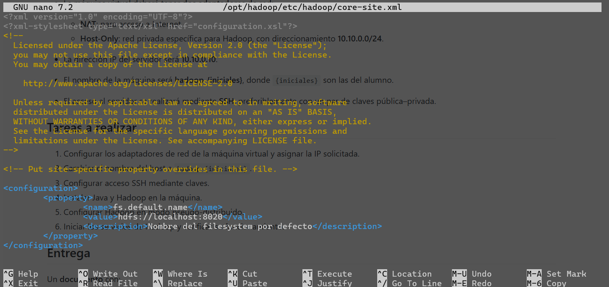
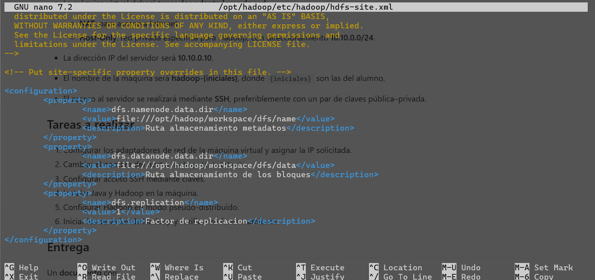
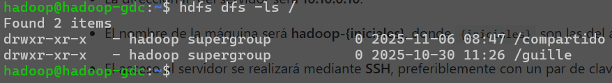
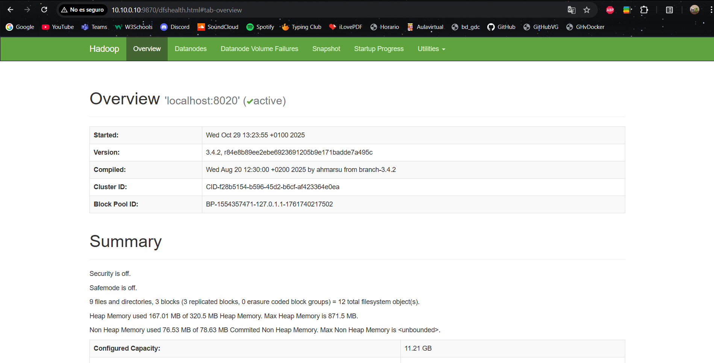

# PR0201: Instalación de Hadoop en modo pseudo-distribuido
## 1. Configuración del sistema
### Configuración de red

### Hostname

### SSH

## 2. Ficheros de hadoop
### .bashrc

### hadoop-env.sh

### core-site.xml

### hdfs-site.xml

## 3. Funcionamiento de HDFS
### Comandos

### Interfaz web
