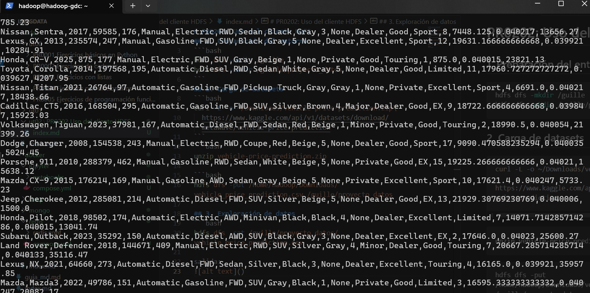
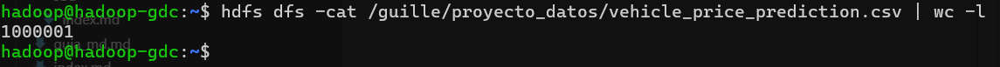
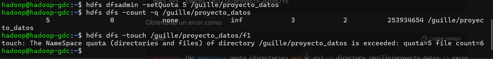

# PR0202: Uso del cliente HDFS
## 1. Preparación del entorno
```bash
hdfs dfs -mkdir /guille
hdfs dfs -mkdir /guille/proyecto_datos
```

## 2. Carga de datasets
```bash
curl -L -o ~/Downloads/vehicle-price-prediction.zip\
  https://www.kaggle.com/api/v1/datasets/download/metawave/vehicle-price-prediction
```
```bash
unzip vehicle-price-prediction.zip
```
```bash
hdfs dfs -put /home/hadoop/Downloads/vehicle_price_prediction.csv /guille/proyecto_datos
```

## 3. Exploración de datos
```bash
hdfs dfs -cat /guille/proyecto_datos/vehicle_price_prediction.csv
```


```bash
hdfs dfs -cat /guille/proyecto_datos/vehicle_price_prediction.csv | wc -l
```


## 4. Organización del proyecto
```bash
hdfs dfs -mkdir /guille/proyecto_datos/procesados
hdfs dfs -mkdir /guille/proyecto_datos/backup

hdfs dfs -cp /guille/proyecto_datos/vehicle_price_prediction.csv /guille/proyecto_datos/backup

hdfs dfs -mv /guille/proyecto_datos/vehicle_price_prediction.csv /guille/proyecto_datos/procesados
```

## 5. Colaboración en el equipo
```bash
hdfs dfs -mkdir /compartido
hdfs dfs -cp /guille/proyecto_datos/procesados/vehicle_price_prediction.csv /compartido
```

## 6. Recuperación de datos
```bash
hdfs dfs -get /guille/proyecto_datos/procesados/vehicle_price_prediction.csv ./
```

## 7. Control de accesos
```bash
hdfs dfs -ls /guille/proyecto_datos
hdfs dfs -ls /guille/proyecto_datos/procesados
hdfs dfs -ls /guille/proyecto_datos/backup

hdfs dfs -chmod 600 /guille/proyecto_datos/backup/vehicle_price_prediction.csv
```

## 8. Mantenimiento
```bash
hdfs dfs -rm /guille/proyecto_datos/prueba.txt
```


## 9. (Opcional, avanzado)
```bash
hdfs dfsadmin -setQuota 5 /guille/proyecto_datos
```
