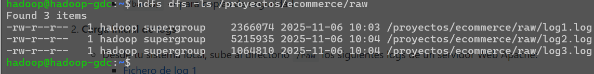
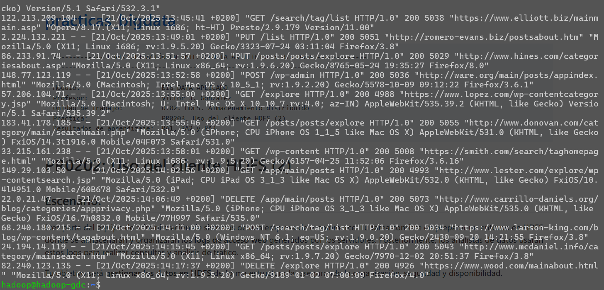
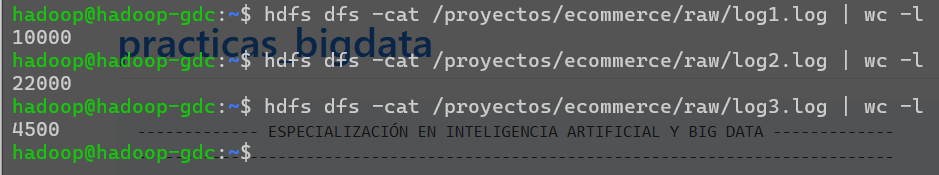
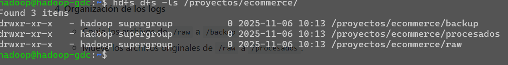
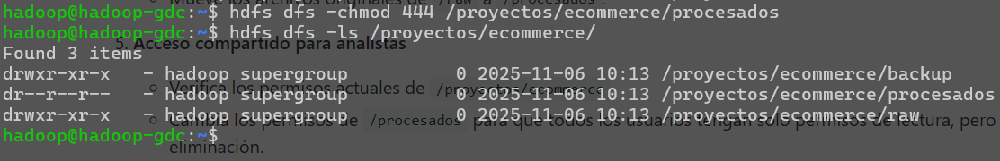
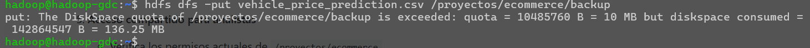

# PR0203: Uso de cliente HDFS(2)
## 1. Preparación el espacio de trabajo en HDFS
```bash
hdfs dfs -mkdir /proyectos
hdfs dfs -mkdir /proyectos/ecommerce
hdfs dfs -mkdir /proyectos/ecommerce/raw
hdfs dfs -mkdir /proyectos/ecommerce/procesados
hdfs dfs -mkdir /proyectos/ecommerce/backup
```

## 2. Carga inicial de logs
Descargamos los logs
```bash
wget -O log1.log https://vgonzalez165.github.io/practicas_bigdata/practicas/bda/ut02/access_log_20251002-131938.log
wget -O log2.log https://vgonzalez165.github.io/practicas_bigdata/practicas/bda/ut02/access_log_20251002-131952.log
wget -O log3.log https://vgonzalez165.github.io/practicas_bigdata/practicas/bda/ut02/access_log_20251002-132005.log
```
Los subimos a la carpeta
```bash
hdfs dfs -put log1.log /proyectos/ecommerce/raw
hdfs dfs -put log2.log /proyectos/ecommerce/raw
hdfs dfs -put log3.log /proyectos/ecommerce/raw
```

## 3. Inspección de datos
Listamos el contenido de /raw
```bash
hdfs dfs -ls /proyectos/ecommerce/raw
```


Visualizamos el contenido
```bash
hdfs dfs -cat /proyectos/ecommerce/raw/log1.log
hdfs dfs -cat /proyectos/ecommerce/raw/log2.log
hdfs dfs -cat /proyectos/ecommerce/raw/log3.log
```


Vemos cuantas lineas tiene
```bash
hdfs dfs -cat /proyectos/ecommerce/raw/log1.log | wc -l
hdfs dfs -cat /proyectos/ecommerce/raw/log2.log | wc -l
hdfs dfs -cat /proyectos/ecommerce/raw/log3.log | wc -l
```


## 4. Organización de los logs
Copiamos los archivos de /raw a /backup
```bash
hdfs dfs -cp /proyectos/ecommerce/raw/log* /proyectos/ecommerce/backup
```

Movemos los originales a procesados
```bash
hdfs dfs -mv /proyectos/ecommerce/raw/log* /proyectos/ecommerce/procesados
```

## 5. Acceso compartido para analistas
Verificamos los permisos
```bash
hdfs dfs -ls /proyectos/ecommerce/
```


Cambiamos los permisos de procesados
```bash
hdfs dfs -chmod 444 /proyectos/ecommerce/procesados
```


## 6. Simulación de trabajo con analistas
```bash
hdfs dfs -get /proyectos/ecommerce/procesados/log1.log
```

## 7. Mantenimiento y limpieza
```bash
hdfs dfs -put prueba.txt /proyectos/ecommerce/procesados/
hdfs dfs -rm /proyectos/ecommerce/procesados/prueba.txt
```

## 8. (Opcional, avanzado)
```bash
hdfs dfsadmin -setSpaceQuota 10M /proyectos/ecommerce/backup
```
