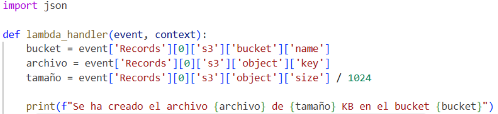
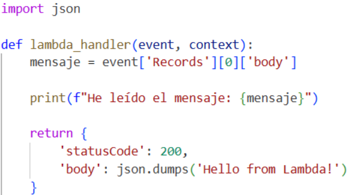
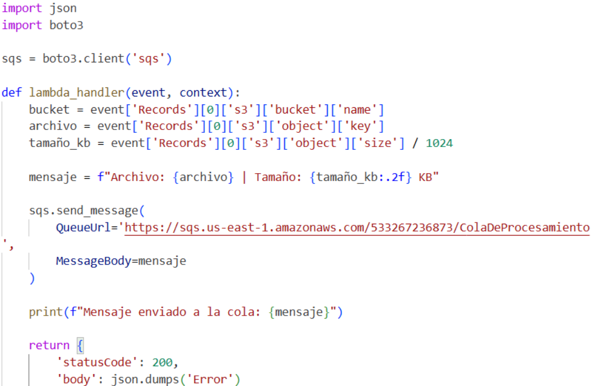
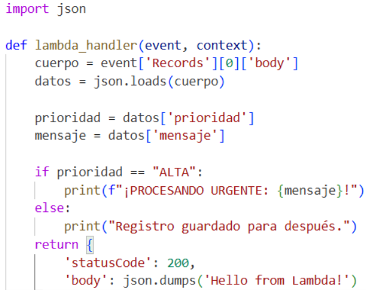
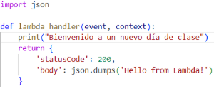
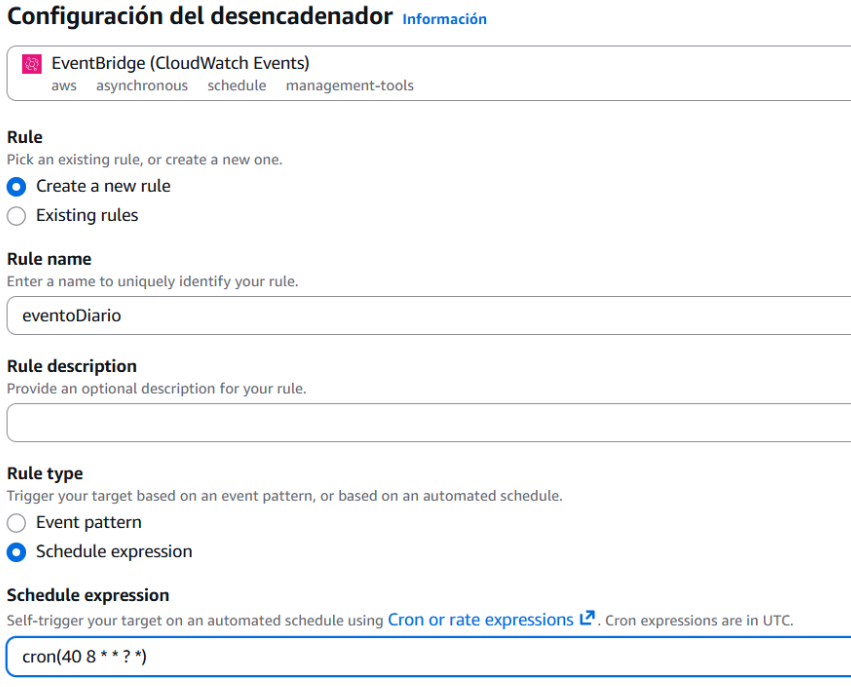
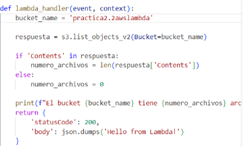
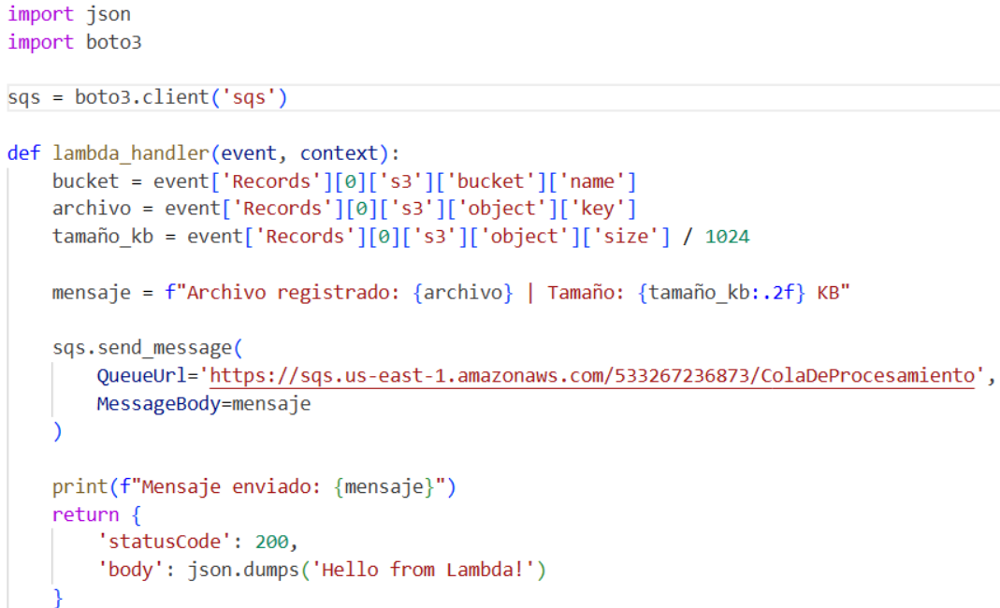
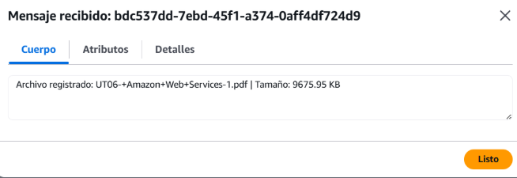

# PR0602: AWS Lambda

## Ejercicio 1


## Ejercicio 2


## Ejercicio 3


## Ejercicio 4


## Ejercicio 5
```python
from dotenv import load_dotenv
import boto3
import json
import os

load_dotenv()
session = boto3.Session(
        aws_access_key_id=os.getenv("aws_access_key_id"),
        aws_secret_access_key=os.getenv("aws_secret_access_key"),
        aws_session_token=os.getenv("aws_session_token"),
        region_name='us-east-1'
    )
sqs = session.client('sqs')

queue_url = 'MiBuzon'

datos_archivo = {
        "prioridad": "ALTA",
        "mensaje": "Mensaje de procesamiento, desde el script"
}

mensaje_serializado = json.dumps(datos_archivo)

response = sqs.send_message(
    QueueUrl=queue_url,
    MessageBody=mensaje_serializado
)
print("Respuesta prioridad alta:", response)


datos_archivo = {
        "prioridad": "BAJA",
        "mensaje": "Mensaje de procesamiento, desde el script"
}

mensaje_serializado = json.dumps(datos_archivo)

response = sqs.send_message(
    QueueUrl=queue_url,
    MessageBody=mensaje_serializado
)

print("Respuesta prioridad baja:", response)
datos_archivo = {
        "prioridad": "MEDIA",
        "mensaje": "Mensaje de procesamiento, desde el script"
}

mensaje_serializado = json.dumps(datos_archivo)

response = sqs.send_message(
    QueueUrl=queue_url,
    MessageBody=mensaje_serializado
)

print("Respuesta prioridad media:", response)
```

```python

```
## Ejercicio 6



## Ejercicio 7


## Ejercicio 8

