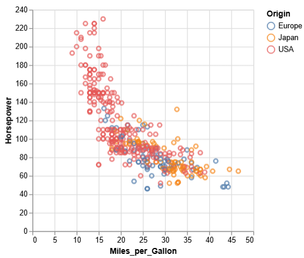
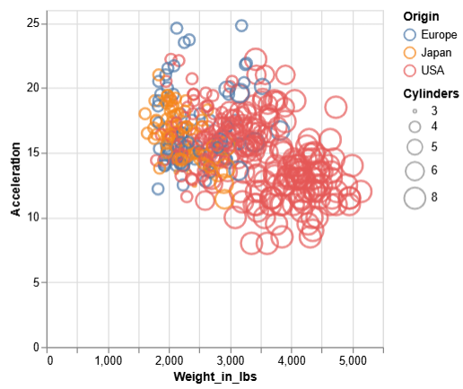
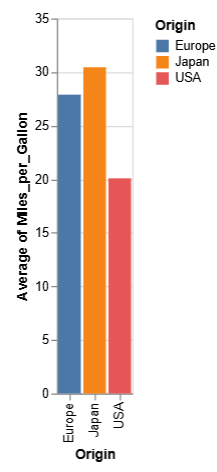
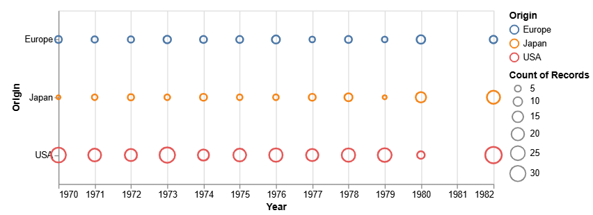
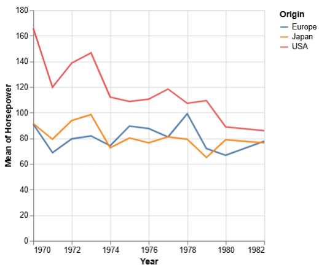
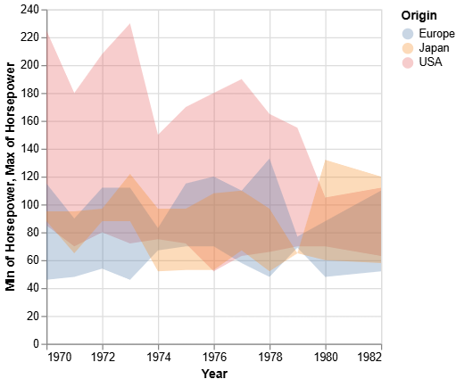
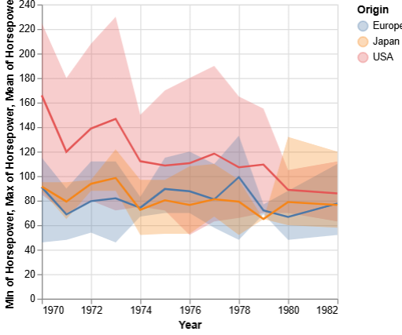
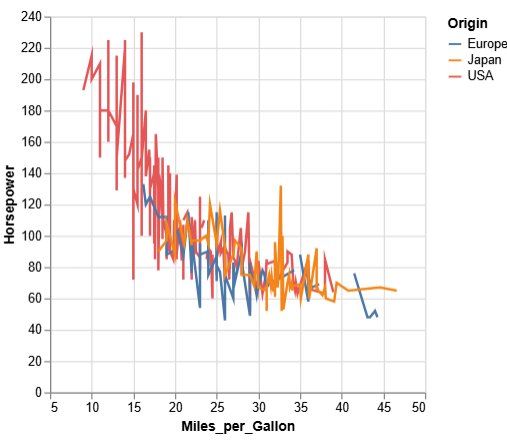

# PR0501: Introducción a Vega Altair

```python
%pip install vega_datasets

from vega_datasets import data  
import pandas as pd
import altair as alt

df = data.cars()
```

## 1 - Relación potencia-eficiencia por región
```python
(alt
    .Chart(df)
    .mark_point()
    .encode(
        alt.Y("Horsepower:Q"),
        alt.X("Miles_per_Gallon:Q"),
        alt.Color("Origin:N")
    )
)
```


## 2 - Análisis de peso y cilindrada
```python
(alt
    .Chart(df)
    .mark_point()
    .encode(
        alt.Y("Acceleration:Q"),
        alt.X("Weight_in_lbs:Q"),
        alt.Size("Cylinders:O"),
        alt.Color("Origin:N")
    )
)
```


## 3 - Comparativa de consumo por origen
```python
(alt
    .Chart(df)
    .mark_bar()
    .encode(
        alt.X("Origin:N"),
        alt.Y("average(Miles_per_Gallon):Q"),
        alt.Color("Origin:N")
    )
)
```


Pregunta: ¿Qué región fabrica, en promedio, coches más eficientes?
La región que fabrica coches más eficientes es Japón.

## 4 - Distribución de modelos en el tiempo
```python
(alt
    .Chart(df)
    .mark_point()
    .encode(
        alt.X("Year:T"),
        alt.Y("Origin:N"),
        alt.Size("count():Q"),
        alt.Color("Origin:N")
    )
     .properties(
         width = 500,
         height = 200
     )
)
```


## 5 - Análisis de evolucion temporal y variabilidad
```python
grafico_linea = (alt
    .Chart(df)
    .mark_line()
    .encode(
        alt.X("Year:T"),
        alt.Y("mean(Horsepower):Q"),
        alt.Color("Origin:N")
    )
)
grafico_linea
```

```python
area_graph = (alt
    .Chart(df)
    .mark_line()
    .encode(
        alt.X("Year:T"),
        alt.Y("mean(Horsepower):Q"),
        alt.Color("Origin:N")
    )
    .mark_area(opacity = 0.3)
    .encode(
        alt.Y("min(Horsepower):Q"),
        alt.Y2("max(Horsepower):N")
    )
)
area_graph
```

```python
area_graph + line_graph
```


## 6 - Experimentación de marcas
```python
(alt
    .Chart(df)
    .mark_line()
    .encode(
        alt.Y("Horsepower:Q"),
        alt.X("Miles_per_Gallon:Q"),
        alt.Color("Origin:N")
    )
)
```


Pregunta: ¿Tiene sentido esta visualización para este tipo de datos? Justifica si la marca elegida es adecuada para representar variables cuantitativas independientes.

No tiene sentido usar líneas para estos datos porque no hay una progresión que muestre tendencias. En lugar de aclarar la información, el gráfico confunde: los valores importantes (los puntos) quedan ocultos entre líneas innecesarias que no aportan significado.