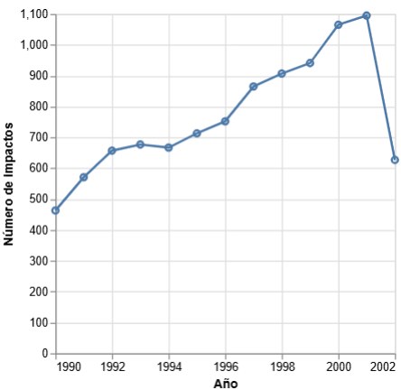
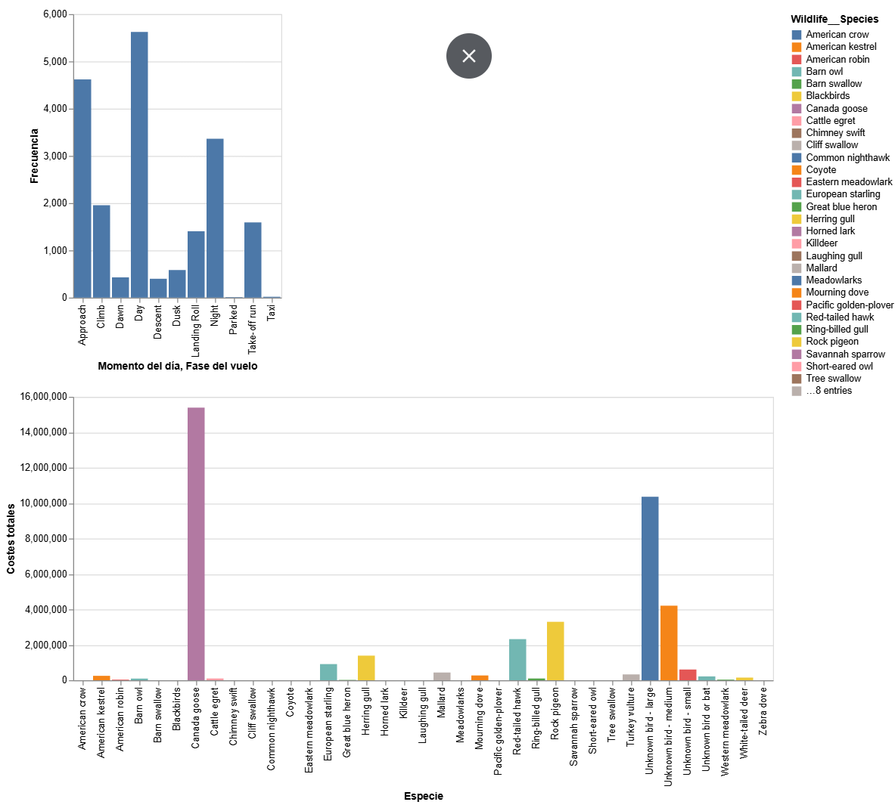
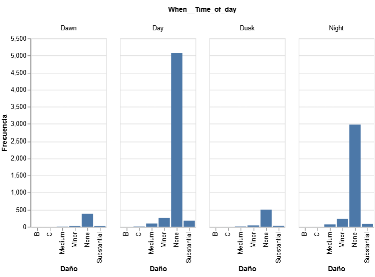
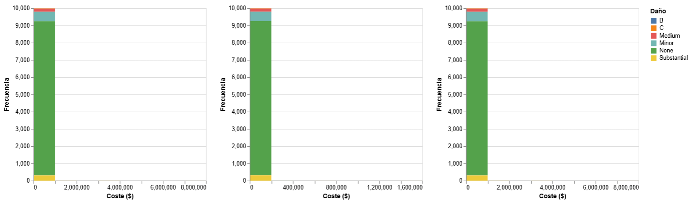

# PR0502: Composición multivista en Altair. Análisis de impactos de aves

```python
%pip install vega_datasets

from vega_datasets import data  
import pandas as pd
import altair as alt
import datetime
```
```python
alt.data_transformers.disable_max_rows()

df = data.birdstrikes()
```

## 1 - Suposición de capas
```python
year_line = (alt
             .Chart(df)
             .mark_line()
             .encode(
                 alt.X("year(Flight_Date):T", title = "Año"),
                 alt.Y("count():Q", title = "Número de impactos")
             )
            )

year_point = (alt
              .Chart(df)
              .mark_point()
              .encode(
                  alt.X("year(Flight_Date):T"),
                  alt.Y("count():Q", title = "Número de impactos"),
                  alt.Tooltip("year(Flight_Date)")
              )
             )

year_line + year_point
```


## 2 - Concatenación para un dashboard
```python
graph_a = (alt
           .Chart(df)
           .mark_bar()
           .encode(
               alt.X("When__Time_of_day:N", title = "Momento del día"),
               alt.Y("count():Q", title = "Frecuencia")
           )
          )

graph_b = (alt
           .Chart(df)
           .mark_bar()
           .encode(
               alt.X("When__Phase_of_flight:N", title = "Fase del vuelo"),
               alt.Y("count():Q", title = "Frecuencia")
           )
          )

graphs = graph_a + graph_b

graph_c = (alt
           .Chart(df)
           .mark_bar()
           .encode(
               alt.X("Wildlife__Species:N", title = "Especie"),
               alt.Y("sum(Cost__Total_$):Q", title = "Costes totales"),
               alt.Color("Wildlife__Species:N")
           )
          )

dashboard = (graphs) & graph_c
dashboard.display()
```


## 3 - Faceteado
```python
impact_count_bar = (alt
    .Chart(df)
    .mark_bar()
    .encode(
        alt.X("Effect__Amount_of_damage:N", title = "Daño"),
        alt.Y("count():Q", title = "Frecuencia"),
        alt.Column("When__Time_of_day:N")
    )
)
impact_count_bar.display()
```


## 4 - Gráficos de repetición
```python
base_chart = (alt
 .Chart(df)
 .mark_bar()
 .encode(
     alt.X(alt.repeat("column"), bin = True, title = "Coste ($)"),
     alt.Y("count():Q", title = "Frecuencia"),
     alt.Color("Effect__Amount_of_damage:N", title = "Daño")
 )
)

repeated_chart = base_chart.repeat(
    column = ["Cost__Repair", "Cost__Other", "Cost__Total_$"]
    )

repeated_chart.display()
```


